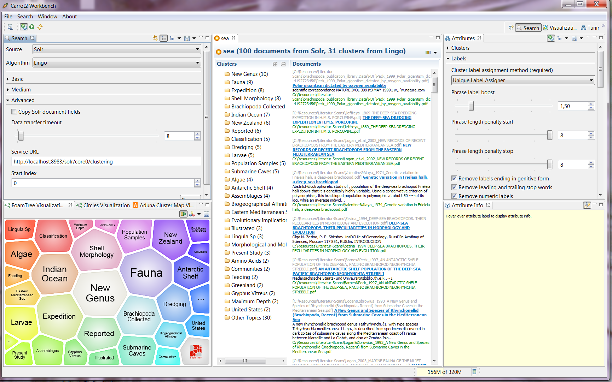

#Apache Solr Instance for Scientific Acrticle Indexing

This project contains a distribution of Apache Solr 4.10.2 with an index of documents on scientific articles for the biology domain.


##Installaion Instructions under Windows
To install this Solr instance, download the project into a dicrector of your choice and in the command line type the following:
+ `cd \`
+ `cd INSTANCE-DIR`
+ `cd MFNLiteratureApp`
+ `java -jar start.jar` to enable clustering the search result type instead: `java -Dsolr.clustering.enabled=true -jar start.jar`
+ Go to: [http://localhost:8983/solr](http://localhost:8983/solr)

##Query
The index is defined under the core "core0". To query the instance use the standard Solr query syntax. You can post the query from the command line using curl or by directly typing in your browser. For example, to query articles about "fish" type the following:

+ In your command line: `curl http://localhost:8983/solr/core0/select/?q=fish`
+ In your browser: `http://localhost:8983/solr/core0/select/?q=fish`

##Adding new documents to the index
To add new document to the index, you can the Post tool provided by Solr. This tool is provided as a jar file called **"post.jar"** which can be found in **"/MFNLiteratureApp/posttool/"**. Note that the added documents must be compatible with the indexing schema as defined in **"/MFNLiteratureApp/solr/HJDcollection/conf/schema.xml"** (more details below). Suppose that the new documents are stored in a directory called "myDocs". The corresponding command is:

+ `java -Dfile.encoding=UTF8 -Dauto=yes -Drecursive=yes  -Durl=http://localhost:8983/solr/core0/update -jar post.jar "myDocs"`

##Indexed File Structure
Documents that can be added to the index must be provieded in XML format. The indexed field are defined in the **schema.xml** file. To extract information from PDF articles according the defined scheme, a PDF extraction tool is provided  [here](https://github.com/HatemMS2012/PDFExtractionTool).

A sample XML file that can be added to provided Solr instance is given here:

```XML
<?xml version="1.0" encoding="UTF-8"?>
<add>
<doc>
<field name="id">documentID</field>
<field name="source-file">The location of the indexed file</field>
<field name="xml-file">The location of the XML file of the indexed file</field>
<field name="language">Language of the document</field>
<field name="auto-keywords">comma separated list of the keywords/topics corresponding to the indexed article</field>
<field name="article-title">title of the article</field>
<field name="abstract">Abstract of the articel</field>
<field name="author">Authors of the article</field>

<!-- List of identified named entities: LOCATION, PERSON, DATE, ORGANIZATION -->
<field name="ORGANIZATION">Organisation 1</field>
<field name="ORGANIZATION">Organisation 2</field
<field name="LOCATION">Location 1</field>
<field name="LOCATION">Location 2</field>
<field name="LOCATION">Location 3</field>
<field name="DATE">Date 1</field>
<field name="DATE">Date 2</field>
<field name="PERSON">Person 1</field>
<field name="PERSON">Person 2</field>
<field name="PERSON">Person 3</field>

<field name="content">The content of the article (all sections, paragraphs, ... </field>
<field name="reference">Referenced article 1</field>
<field name="reference">Referenced article 1</field>
<field name="reference">Referenced article 1</field>
<field name="reference">Referenced article 1</field>
</doc>
</add>
```

##Configuring the Instance with Carrot<sup>2</sup>

You can configure [Carrot<sup>2</sup>](http://project.carrot2.org) to use the provided Solr instance. For example [Carrot2 Workbench](http://project.carrot2.org/download.html) can be configured as shown in the following screenshot:


